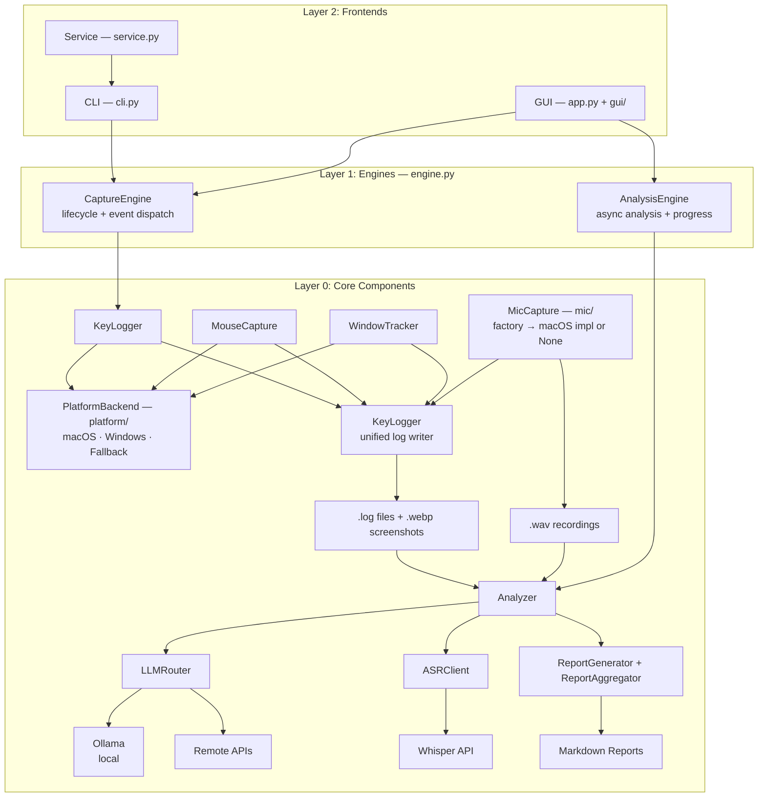

# CLAUDE.md

This file provides guidance to Claude Code (claude.ai/code) when working with code in this repository.

## Project Overview

OpenCapture is a cross-platform tool (macOS, Windows, Linux) that records keyboard and mouse activity, captures screenshots, optionally records microphone audio, and uses AI (local Ollama or remote APIs) to analyze user behavior. All data is stored locally. Platform-specific functionality is abstracted behind a backend interface (`src/opencapture/platform/`).

## Installation & Commands

```bash
# Setup (development)
python3 -m venv venv && source venv/bin/activate
pip install -e ".[dev]"

# Run capture mode (foreground)
python run.py                          # Start recording (dev entry point)
opencapture                            # Start recording (installed CLI)

# Run analysis mode
opencapture --analyze today            # Analyze today's data
opencapture --analyze 2026-02-01       # Analyze specific date
opencapture --image path/to/img.webp   # Analyze single image
opencapture --audio path/to/mic.wav    # Transcribe single audio
opencapture --provider openai --analyze today  # Use specific LLM

# Using remote APIs (requires privacy.allow_online: true in config)
export OPENAI_API_KEY=sk-xxx
export ANTHROPIC_API_KEY=sk-ant-xxx

# Utilities
opencapture --health-check             # Check LLM service status
opencapture --list-dates               # List available dates

# GUI (macOS menu bar app)
opencapture gui                        # Launch menu bar GUI
opencapture-gui                        # Standalone GUI entry point

# Service management (macOS: launchd, Windows: PID-file process)
opencapture start                      # Start as background service
opencapture stop                       # Stop service
opencapture restart                    # Restart service
opencapture status                     # Show running state and today's stats
opencapture log [-f]                   # Show/follow service logs

# Three install methods:
# 1. Clone repo:    python run.py
# 2. pip install:   pip install opencapture && opencapture
# 3. .app bundle:   Download from GitHub Releases (PyInstaller)
```

## Architecture

Three-layer design (see `docs/specs/architecture.md` for full spec):



**Key modules:**

- `src/opencapture/platform/` - Platform backend abstraction: `PlatformBackend` ABC (`_base.py`), `MacOSBackend` (`_macos.py`), `WindowsBackend` (`_windows.py`), `FallbackBackend` (`_fallback.py`). Singleton factory `get_backend()` in `__init__.py`
- `src/opencapture/auto_capture.py` - Core capture: `KeyLogger`, `MouseCapture`, `WindowTracker`, `AutoCapture`. All platform calls go through `get_backend()`
- `src/opencapture/mic/` - Microphone capture: `MicCaptureBase` ABC (`_base.py`), `MacOSMicCapture` (`macos.py`). Factory `create_mic_capture()` in `__init__.py` returns platform impl or None
- `src/opencapture/engine.py` - Engine layer: `CaptureEngine` (lifecycle + event dispatch), `AnalysisEngine` (async analysis + progress)
- `src/opencapture/service.py` - Service management: `ServiceManager` ABC, `LaunchdManager` (macOS), `ProcessManager` (Windows). Factory `get_service_manager()`
- `src/opencapture/gui/` - Cross-platform GUI: `TrayAppBase` (`base.py`), `MacOSTrayApp` (`macos.py`), `GenericTrayApp` (`generic.py`). Factory `create_app()` in `__init__.py`
- `src/opencapture/app.py` - GUI entry point: config init → `create_app(config).run()`
- `src/opencapture/cli.py` - Unified CLI: capture via `CaptureEngine`, analysis, service management via `ServiceManager`, GUI launch
- `src/opencapture/llm_client.py` - LLM abstraction: `BaseLLMClient`, `OllamaClient`, `OpenAIClient`, `AnthropicClient`, `LLMRouter`, `ASRClient`
- `src/opencapture/analyzer.py` - Orchestrates LLM analysis and audio transcription with `Analyzer` class
- `src/opencapture/report_generator.py` - Markdown report generation: `ReportGenerator`, `ReportAggregator`
- `src/opencapture/config.py` - Configuration management with environment variable support
- `run.py` - Development entry point (thin wrapper with sys.path hack)
- `packaging/macos.spec` - PyInstaller spec for macOS .app bundle
- `packaging/windows.spec` - PyInstaller spec for Windows .exe

## Configuration

Config priority: Environment variables > `~/.opencapture/config.yaml` > defaults

Key environment variables:
- `OPENAI_API_KEY`, `ANTHROPIC_API_KEY` - Enable remote LLM providers (auto-sets `llm.*.enabled: true`)
- `OLLAMA_API_URL`, `OLLAMA_MODEL` - Local Ollama settings
- `OPENCAPTURE_ALLOW_ONLINE` - Allow remote providers (privacy gate)

Example config is bundled at `src/opencapture/config/example.yaml`. Prompts for image analysis (click/dblclick/drag) and keyboard log analysis are separately configurable.

Privacy: Remote providers (openai/anthropic/custom) require `privacy.allow_online: true` in config. The analyzer shows a confirmation prompt before sending data to remote APIs.

## Data Format

Screenshots: `{action}_{HHmmss}_{ms}_{button}_x{X}_y{Y}.webp`
- Actions: `click_`, `dblclick_`, `drag_`
- Drag includes: `_to_x{X2}_y{Y2}`

Audio: `mic_{HHmmss}_{ms}_{app}_dur{N}.wav` (16kHz mono PCM)
- Recorded only when external apps use the microphone
- Short recordings (< `mic_min_duration_ms`) are discarded

Logs: `~/opencapture/YYYY-MM-DD/YYYY-MM-DD.log` with window blocks separated by triple newlines.
- `📷` lines = screenshot events, `⌨️` lines = keyboard input, `🎤` lines = mic events (mic_start/mic_stop/mic_join/mic_leave)

Analysis: Each `.webp` and `.wav` gets a companion `.txt` file with the LLM/ASR result.

Reports: `~/opencapture/reports/YYYY-MM-DD.md` and `YYYY-MM-DD_images.md`

## Platform Requirements

### macOS

Requires permissions in System Settings > Privacy & Security:
- **Accessibility** - for keyboard/mouse monitoring
- **Screen Recording** - for screenshots
- **Microphone** - for audio recording (if `mic_enabled: true`)

When built with PyInstaller, the `.app` bundle (`OpenCapture.app`) has bundle ID `com.opencapture.agent` so macOS TCC shows "OpenCapture" in permission dialogs.

### Windows

- No special permissions required for keyboard/mouse monitoring
- Microphone capture is not yet supported (returns None from `create_mic_capture()`)
- Service management uses PID-file based process tracking (`ProcessManager`)

## Testing

```bash
pip install -e ".[dev]"
pytest tests/ -v
```
