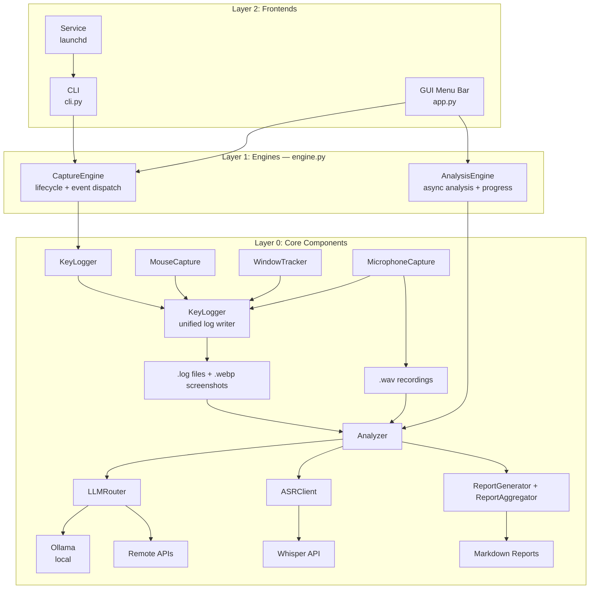

# OpenCapture

**Context capture for proactive AI agents. Keyboard, mouse, screenshots, audio -- collected naturally, stored locally.**

**为主动式智能体提供上下文采集。键盘、鼠标、截图、音频 -- 自然采集，本地存储。**

[](https://pypi.org/project/opencapture/)
[](LICENSE)
[](https://www.python.org/downloads/)

[中文文档](README_zh.md)

---

## Why OpenCapture? | 为什么需要 OpenCapture？

**No context, no proactive agent.**

Proactive AI agents need to understand what you are doing before they can help. Without rich, continuous context about your work, an agent can only react to explicit commands -- it can never anticipate your needs.

OpenCapture solves this by collecting context naturally and non-intrusively in the background: every keystroke, mouse action, screenshot, and microphone event is recorded as you work. You do not need to manually log anything. The result is a detailed activity stream that proactive agents can reason over.

**没有上下文，就没有主动式智能体。**

主动式智能体需要理解你正在做什么，才能真正帮到你。没有持续的、丰富的上下文，智能体只能被动响应指令，永远无法主动预判你的需求。

OpenCapture 通过自然、无感的方式在后台采集上下文：键盘输入、鼠标操作、屏幕截图、麦克风事件，全部自动记录，无需手动操作。这为主动式智能体提供了完整的工作活动流。

### Design Principles | 设计原则

- **Non-intrusive capture** -- runs silently in the background; no workflow disruption | **无感采集** -- 后台静默运行，不打断工作流
- **Local-first** -- all data stored and processed on your machine by default | **本地优先** -- 数据默认存储和处理在本地
- **Privacy by design** -- remote APIs require explicit opt-in; no data leaves your machine unless you choose | **隐私优先** -- 远程 API 需要显式开启，数据不会在未经许可的情况下离开本机
- **AI-powered understanding** -- not just raw logs, but structured analysis via local or cloud LLMs | **AI 驱动理解** -- 不只是原始日志，而是通过本地或云端 LLM 进行结构化分析

## Features | 功能特性

- **Keyboard Logging** -- global key listening, grouped by active window, 20-second time clustering
- **Mouse Screenshots** -- single click, double click, drag detection with WebP compression
- **Window Tracking** -- auto-detect active window with blue border annotation on screenshots
- **Microphone Capture** -- records when external apps use the mic; identifies the process via macOS AudioProcess API
- **AI Analysis** -- local Ollama or remote APIs (OpenAI, Anthropic Claude)
- **Audio Transcription** -- Whisper-based speech-to-text for recorded audio
- **Report Generation** -- automated daily Markdown reports from captured data
- **macOS Menu Bar App** -- system tray GUI with real-time log window and one-click analysis
- **Background Service** -- launchd integration for always-on capture

## Quick Start | 快速开始

### Install | 安装

**Option 1: pip install** (recommended)

```bash
pip install opencapture
```

**Option 2: Clone and develop**

```bash
git clone https://github.com/daibor/opencapture.git
cd opencapture
pip install -e ".[dev]"
```

**Option 3: Download .app** (macOS)

Download from [GitHub Releases](https://github.com/daibor/opencapture/releases).

### Run | 运行

```bash
# Start capture (foreground)
opencapture

# Launch macOS menu bar GUI
opencapture gui

# Start as background service (macOS)
opencapture start

# Analyze today's captured data
opencapture --analyze today

# Check service status
opencapture status
```

### GUI

The menu bar app provides a visual interface for controlling capture and triggering analysis:

```bash
opencapture gui          # Launch from CLI
opencapture-gui          # Standalone entry point
```

### Service Management (macOS)

```bash
opencapture start        # Start as background service
opencapture stop         # Stop service
opencapture restart      # Restart service
opencapture status       # Show running state and today's stats
opencapture log [-f]     # Show/follow service logs
```

### Analysis | 分析

```bash
# Analyze today's data
opencapture --analyze today

# Analyze specific date
opencapture --analyze 2026-02-01
opencapture --analyze yesterday

# Analyze single image or audio file
opencapture --image path/to/screenshot.webp
opencapture --audio path/to/mic.wav

# Use a specific remote provider
export OPENAI_API_KEY=sk-xxx
opencapture --provider openai --analyze today

# Skip report generation
opencapture --analyze today --no-reports

# Utilities
opencapture --health-check     # Check LLM service health
opencapture --list-dates       # List available capture dates
opencapture --help             # Show all options
```

## Security & Privacy | 安全与隐私

OpenCapture is designed with a strict privacy model:

| Principle | Detail |
|---|---|
| **Local by default** | All captured data stays on your machine in `~/opencapture/` |
| **Explicit opt-in for remote** | Remote LLM providers (OpenAI, Anthropic) require `privacy.allow_online: true` in config |
| **Confirmation prompt** | Before sending data to any remote API, a confirmation prompt is shown |
| **No telemetry** | OpenCapture sends zero telemetry or analytics data |
| **You own your data** | All files are plain text logs, WebP images, WAV audio, and Markdown reports |

**Privacy warning:** This tool records all keyboard input (including passwords) and screen content. Ensure your storage directory has appropriate access controls. Use for personal purposes only.

OpenCapture 的隐私模型：所有数据默认仅存储在本地。远程 LLM 需要在配置中显式开启 `privacy.allow_online: true`，且每次发送数据前会弹出确认提示。不发送任何遥测数据。

## Architecture | 架构

Three-layer design separating core components, engines, and frontends:



**Key modules:**

| Module | Purpose |
|---|---|
| `auto_capture.py` | Core capture: KeyLogger, MouseCapture, WindowTracker |
| `mic_capture.py` | Microphone monitoring via Core Audio + sounddevice |
| `engine.py` | CaptureEngine (lifecycle) + AnalysisEngine (async analysis) |
| `app.py` | macOS menu bar GUI (PyObjC) |
| `llm_client.py` | LLM abstraction: Ollama, OpenAI, Anthropic, custom providers |
| `analyzer.py` | Orchestrates LLM analysis and audio transcription |
| `report_generator.py` | Markdown report generation and aggregation |
| `config.py` | Configuration management with environment variable support |
| `cli.py` | Unified CLI: capture, analysis, service management, GUI launch |

## OpenClaw Ecosystem | OpenClaw 生态

OpenCapture is the **context capture layer** for the [OpenClaw](https://github.com/nicekate) proactive agent ecosystem.

```
User Activity  -->  OpenCapture  -->  Context Stream  -->  Proactive Agent
用户活动           上下文采集          活动流               主动式智能体
```

The proactive agent philosophy is simple: an AI that can anticipate your needs must first understand what you are doing. OpenCapture provides that understanding by building a continuous, structured record of your work -- the raw material that proactive agents consume to make intelligent suggestions, automate repetitive tasks, and surface relevant information at the right moment.

主动式智能体的理念很简单：一个能预判你需求的 AI，首先必须理解你在做什么。OpenCapture 通过持续构建结构化的工作记录来提供这种理解 -- 这是主动式智能体进行智能推荐、自动化重复任务、在恰当时机呈现相关信息的基础。

## System Requirements | 系统要求

- **macOS** 10.15+ (capture + analysis)
- **Linux / Windows** (analysis only)
- Python 3.11+
- 8GB+ RAM (for local AI analysis)
- 10GB+ disk space (for local model storage)

### macOS Permissions | macOS 权限

First run requires authorization in **System Settings > Privacy & Security**:

| Permission | Purpose |
|---|---|
| **Accessibility** | Keyboard and mouse event listening |
| **Screen Recording** | Screen capture |
| **Microphone** | Audio recording (if enabled) |

## Data Storage | 数据存储

Default location: `~/opencapture/`

```
~/opencapture/
├── 2026-02-01/
│   ├── 2026-02-01.log                              # Unified activity log
│   ├── click_103045_123_left_x800_y600.webp        # Click screenshot
│   ├── dblclick_103046_456_left_x800_y600.webp     # Double-click screenshot
│   ├── drag_103050_789_left_x100_y200_to_x500_y400.webp  # Drag screenshot
│   └── mic_103100_000_zoom_dur30.wav               # Mic recording
├── reports/
│   ├── 2026-02-01.md                               # Daily report
│   └── 2026-02-01_images.md                        # Image analysis report
└── 2026-02-02/
    └── ...
```

## Configuration | 配置

Edit `~/.opencapture/config.yaml` to customize behavior:

```bash
vim ~/.opencapture/config.yaml
```

### Key Settings | 主要配置项

| Setting | Description |
|---|---|
| `llm.default_provider` | LLM provider: `ollama` / `openai` / `anthropic` / `custom` |
| `llm.*.model` | Model selection per provider |
| `capture.output_dir` | Data storage directory |
| `capture.mic_enabled` | Enable microphone capture |
| `privacy.allow_online` | Allow remote API providers |
| `prompts.*` | Custom analysis prompts |

### Environment Variables | 环境变量

| Variable | Purpose |
|---|---|
| `OPENAI_API_KEY` | Enable OpenAI provider |
| `ANTHROPIC_API_KEY` | Enable Anthropic Claude provider |
| `OLLAMA_API_URL` | Custom Ollama API endpoint |
| `OLLAMA_MODEL` | Ollama model selection |
| `OPENCAPTURE_ALLOW_ONLINE` | Allow remote providers |

Config priority: Environment variables > `~/.opencapture/config.yaml` > built-in defaults.

## Uninstall | 卸载

```bash
pip uninstall opencapture
```

To remove captured data: `rm -rf ~/opencapture`
To remove config: `rm -rf ~/.opencapture`

## Contributing | 参与贡献

```bash
git clone https://github.com/daibor/opencapture.git
cd opencapture
pip install -e ".[dev]"
pytest tests/ -v
```

See [architecture docs](docs/specs/architecture.md) for detailed design information.

## License | 许可证

[MIT](LICENSE)
