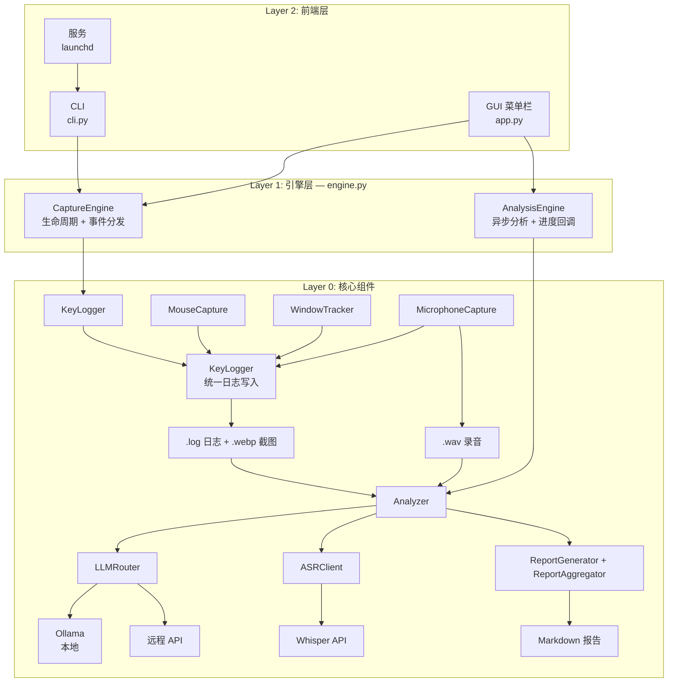

# OpenCapture

**为主动式智能体提供上下文采集。键盘、鼠标、截图、音频 -- 自然采集，本地存储。**

[](https://pypi.org/project/opencapture/)
[](LICENSE)
[](https://www.python.org/downloads/)

[English](README.md)

---

## 为什么需要 OpenCapture？

**没有上下文，就没有主动式智能体。**

主动式智能体需要理解你正在做什么，才能真正帮到你。没有持续的、丰富的上下文，智能体只能被动响应你的指令，永远无法主动预判你的需求。

OpenCapture 通过自然、无感的方式在后台采集上下文：键盘输入、鼠标操作、屏幕截图、麦克风事件，全部自动记录，无需手动操作。这为主动式智能体提供了完整的工作活动流。

### 设计原则

- **无感采集** -- 后台静默运行，不打断工作流
- **本地优先** -- 数据默认存储和处理在本地
- **隐私优先** -- 远程 API 需要显式开启，数据不会在未经许可的情况下离开本机
- **AI 驱动理解** -- 不只是原始日志，而是通过本地或云端 LLM 进行结构化分析

## 功能特性

- **键盘记录** -- 全局按键监听，按活跃窗口聚合，20 秒时间聚类
- **鼠标截图** -- 支持单击、双击、拖拽检测，WebP 格式压缩
- **窗口追踪** -- 自动检测活跃窗口，截图标注蓝色边框
- **麦克风采集** -- 当外部应用使用麦克风时自动录制，通过 macOS AudioProcess API 识别进程
- **AI 分析** -- 支持本地 Ollama 或远程 API（OpenAI、Anthropic Claude）
- **语音转文字** -- 基于 Whisper 的音频转录
- **报告生成** -- 从采集数据自动生成每日 Markdown 报告
- **macOS 菜单栏应用** -- 系统托盘 GUI，实时日志窗口，一键分析
- **后台服务** -- 通过 launchd 实现常驻采集

## 快速开始

### 安装

**方式一：pip install**（推荐）

```bash
pip install opencapture
```

**方式二：克隆开发**

```bash
git clone https://github.com/daibor/opencapture.git
cd opencapture
pip install -e ".[dev]"
```

**方式三：下载 .app**（macOS）

从 [GitHub Releases](https://github.com/daibor/opencapture/releases) 下载。

### 运行

```bash
# 启动采集（前台运行）
opencapture

# 启动 macOS 菜单栏 GUI
opencapture gui

# 后台服务启动（macOS）
opencapture start

# 分析今天的采集数据
opencapture --analyze today

# 查看服务状态
opencapture status
```

### GUI 菜单栏应用

```bash
opencapture gui          # 从命令行启动
opencapture-gui          # 独立入口
```

### 服务管理（macOS）

```bash
opencapture start        # 后台启动服务
opencapture stop         # 停止服务
opencapture restart      # 重启服务
opencapture status       # 查看运行状态和今日统计
opencapture log [-f]     # 查看/追踪服务日志
```

### 分析

```bash
# 分析今天的数据
opencapture --analyze today

# 分析指定日期
opencapture --analyze 2026-02-01
opencapture --analyze yesterday

# 分析单张图片或音频文件
opencapture --image path/to/screenshot.webp
opencapture --audio path/to/mic.wav

# 使用指定的远程提供商
export OPENAI_API_KEY=sk-xxx
opencapture --provider openai --analyze today

# 跳过报告生成
opencapture --analyze today --no-reports

# 实用工具
opencapture --health-check     # 检查 LLM 服务状态
opencapture --list-dates       # 列出可用的采集日期
opencapture --help             # 查看所有选项
```

## 安全与隐私

OpenCapture 采用严格的隐私模型：

| 原则 | 说明 |
|---|---|
| **默认本地** | 所有采集数据存储在本地 `~/opencapture/` |
| **远程需显式开启** | 远程 LLM 提供商（OpenAI、Anthropic）需要在配置中设置 `privacy.allow_online: true` |
| **确认提示** | 向远程 API 发送数据前会弹出确认提示 |
| **零遥测** | 不发送任何遥测或分析数据 |
| **数据归你所有** | 所有文件均为纯文本日志、WebP 图片、WAV 音频和 Markdown 报告 |

**隐私警告：** 本工具会记录所有键盘输入（包括密码）和屏幕内容。请确保存储目录有适当的访问控制，仅用于个人用途。

## 架构

三层架构设计，分离核心组件、引擎层和前端层：



**核心模块：**

| 模块 | 用途 |
|---|---|
| `auto_capture.py` | 核心采集：KeyLogger、MouseCapture、WindowTracker |
| `mic_capture.py` | 麦克风监听，基于 Core Audio + sounddevice |
| `engine.py` | CaptureEngine（生命周期）+ AnalysisEngine（异步分析） |
| `app.py` | macOS 菜单栏 GUI（PyObjC） |
| `llm_client.py` | LLM 抽象层：Ollama、OpenAI、Anthropic、自定义提供商 |
| `analyzer.py` | 编排 LLM 分析和音频转录 |
| `report_generator.py` | Markdown 报告生成和聚合 |
| `config.py` | 配置管理，支持环境变量 |
| `cli.py` | 统一 CLI：采集、分析、服务管理、GUI 启动 |

## OpenClaw 生态

OpenCapture 是 [OpenClaw](https://github.com/nicekate) 主动式智能体生态的**上下文采集层**。

```
用户活动  -->  OpenCapture  -->  活动流  -->  主动式智能体
```

主动式智能体的理念很简单：一个能预判你需求的 AI，首先必须理解你在做什么。OpenCapture 通过持续构建结构化的工作记录来提供这种理解 -- 这是主动式智能体进行智能推荐、自动化重复任务、在恰当时机呈现相关信息的基础。

## 系统要求

- **macOS** 10.15+（采集 + 分析）
- **Linux / Windows**（仅分析功能）
- Python 3.11+
- 8GB+ 内存（本地 AI 分析需要）
- 10GB+ 磁盘空间（本地模型存储）

### macOS 权限

首次运行需在「系统设置 > 隐私与安全性」中授权：

| 权限 | 用途 |
|---|---|
| **辅助功能** | 监听键鼠事件 |
| **屏幕录制** | 截取屏幕 |
| **麦克风** | 音频录制（如启用） |

## 数据存储

默认存储位置：`~/opencapture/`

```
~/opencapture/
├── 2026-02-01/
│   ├── 2026-02-01.log                              # 统一活动日志
│   ├── click_103045_123_left_x800_y600.webp        # 单击截图
│   ├── dblclick_103046_456_left_x800_y600.webp     # 双击截图
│   ├── drag_103050_789_left_x100_y200_to_x500_y400.webp  # 拖拽截图
│   └── mic_103100_000_zoom_dur30.wav               # 麦克风录音
├── reports/
│   ├── 2026-02-01.md                               # 每日报告
│   └── 2026-02-01_images.md                        # 图片分析报告
└── 2026-02-02/
    └── ...
```

## 配置

编辑 `~/.opencapture/config.yaml`：

```bash
vim ~/.opencapture/config.yaml
```

### 主要配置项

| 配置项 | 说明 |
|---|---|
| `llm.default_provider` | LLM 提供商：`ollama` / `openai` / `anthropic` / `custom` |
| `llm.*.model` | 各提供商的模型选择 |
| `capture.output_dir` | 数据存储目录 |
| `capture.mic_enabled` | 启用麦克风采集 |
| `privacy.allow_online` | 允许远程 API 提供商 |
| `prompts.*` | 自定义分析提示词 |

### 环境变量

| 变量 | 用途 |
|---|---|
| `OPENAI_API_KEY` | 启用 OpenAI |
| `ANTHROPIC_API_KEY` | 启用 Anthropic Claude |
| `OLLAMA_API_URL` | 自定义 Ollama API 地址 |
| `OLLAMA_MODEL` | Ollama 模型选择 |
| `OPENCAPTURE_ALLOW_ONLINE` | 允许远程提供商 |

配置优先级：环境变量 > `~/.opencapture/config.yaml` > 内置默认值。

## 卸载

```bash
pip uninstall opencapture
```

删除采集数据：`rm -rf ~/opencapture`
删除配置：`rm -rf ~/.opencapture`

## 参与贡献

```bash
git clone https://github.com/daibor/opencapture.git
cd opencapture
pip install -e ".[dev]"
pytest tests/ -v
```

详细设计文档请参阅 [架构文档](docs/specs/architecture.md)。

## 许可证

[MIT](LICENSE)
