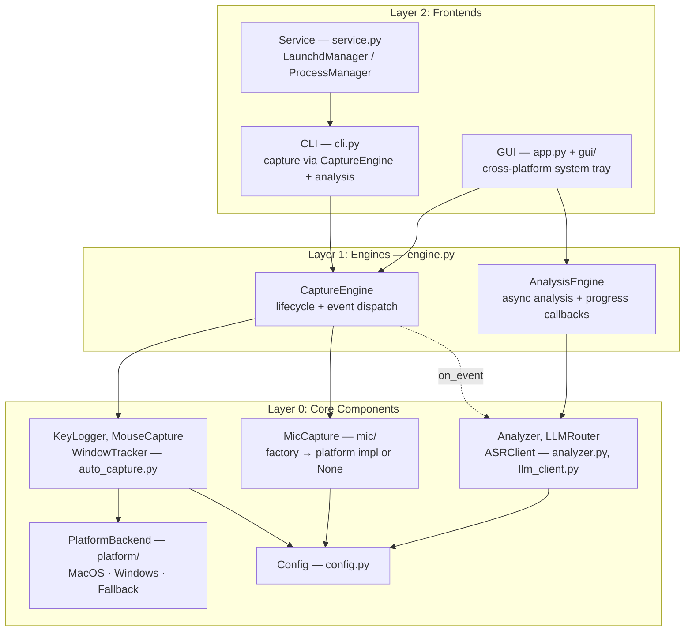
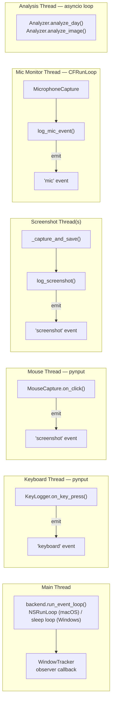
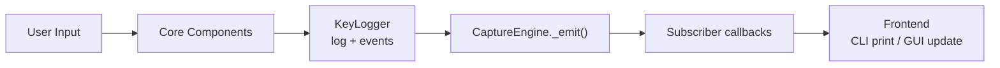

# Three-Layer Architecture Specification

## Overview

OpenCapture uses a three-layer architecture that separates core components, engine logic, and frontends. This enables multiple frontends (CLI, GUI, service) to share the same capture and analysis engines without duplicating logic.

## Layers



## Layer 0: Core Components

Core components handle raw input capture, platform abstraction, and AI analysis.

### Platform Backend (platform/)

ABC-based platform abstraction with a singleton factory `get_backend()`:

- **PlatformBackend** (`_base.py`) — Abstract base defining: `get_active_window_info()`, `get_window_at_point()`, `get_active_window_bounds()`, `start_window_observer()`, `stop_window_observer()`, `check_accessibility()`, `run_event_loop()`, `get_key_symbols()`
- **MacOSBackend** (`_macos.py`) — AppKit/Quartz window info, NSWorkspace notification observer, AXIsProcessTrusted, NSRunLoop event loop, macOS Unicode key symbols
- **WindowsBackend** (`_windows.py`) — Win32 ctypes (GetForegroundWindow, GetWindowText), polling-based window observer, Windows key labels (Ctrl/Alt/Win)
- **FallbackBackend** (`_fallback.py`) — Minimal stubs for unsupported platforms

### Capture Components (auto_capture.py)

- **KeyLogger** — Keyboard event aggregation, log writing, screenshot/mic event logging. Key symbols loaded from `get_backend().get_key_symbols()`
- **MouseCapture** — Click/double-click/drag detection, screenshot capture. Window info via `get_backend().get_window_at_point()`
- **WindowTracker** — Active window monitoring via `get_backend().start_window_observer()` (NSWorkspace on macOS, polling on Windows)
- **AutoCapture** — Controller that wires components together, manages pynput listeners

### Microphone Capture (mic/)

Factory pattern with `create_mic_capture()` returning platform-appropriate implementation or None:

- **MicCaptureBase** (`_base.py`) — ABC with `start()` and `stop()` methods
- **MacOSMicCapture** (`macos.py`) — Core Audio microphone monitoring, sounddevice recording. Records when external apps use the mic; identifies process via macOS 14+ AudioProcess API
- Returns `None` on non-macOS platforms (microphone capture not yet supported)

### Analysis Components (analyzer.py, llm_client.py)

- **Analyzer** — Orchestrates image/audio/log analysis and report generation
- **LLMRouter** — Routes requests to configured LLM providers
- **ASRClient** — Audio transcription via Whisper API

### Changes for Engine Support

KeyLogger and AutoCapture accept an optional `on_event` callback. When set, KeyLogger emits events at each write point (keyboard flush, screenshot log, window activation, mic event). This allows the engine layer to observe all activity without modifying core logic.

## Layer 1: Engines (engine.py)

### CaptureEngine

Manages the capture lifecycle and dispatches events to subscribers.

```python
class CaptureEngine:
    def __init__(self, config: Config)
    def subscribe(self, event_type: str, callback: Callable)  # '*' for all
    def start(self)   # Creates AutoCapture, starts listeners
    def stop(self)    # Stops capture, emits status event
    def is_running -> bool
    def get_status(self) -> dict  # Today's stats
    def check_accessibility(prompt=False) -> bool
```

**Event types:** `keyboard`, `screenshot`, `window`, `mic`, `status`

**Key design decisions:**
- Does NOT own NSRunLoop — the frontend is responsible for running the event loop
- Events fire from capture threads; frontends must dispatch to their own main thread
- Subscriber callbacks receive `(event_type: str, data: dict)`

### AnalysisEngine

Runs analysis tasks in a background asyncio event loop.

```python
class AnalysisEngine:
    def __init__(self, config: Config)
    def start(self)   # Start background event loop thread
    def stop(self)    # Stop event loop and thread
    def analyze_today(self, provider=None, callback=None)
    def analyze_image(self, path, provider=None, callback=None)
    def health_check(self, callback=None)
```

**Key design decisions:**
- Owns its own asyncio event loop in a daemon thread
- Callbacks are invoked from the asyncio thread; frontends dispatch to main thread
- Accepts Config object (not raw dicts)

## Layer 2: Frontends

### CLI (cli.py)

The command-line interface. All capture goes through CaptureEngine (unified entry point for all three distribution methods).

- `opencapture` — Foreground capture via CaptureEngine + `backend.run_event_loop()`
- `opencapture --analyze today` — Analysis via Analyzer
- `opencapture start/stop/status` — Service management via `ServiceManager`
- `opencapture gui` — Launch GUI frontend

### GUI (app.py)

macOS menu bar application using PyObjC.

- NSStatusItem in the system menu bar
- Start/Stop capture toggle
- Log window showing real-time events
- Analyze Today trigger with progress feedback
- Uses CaptureEngine + AnalysisEngine
- NSApplication.run() pumps NSRunLoop (required for WindowTracker)

### Service (service.py)

Background daemon managed via `opencapture start/stop`. Uses `ServiceManager` abstraction:

- **LaunchdManager** (macOS) — manages launchd plist, runs CLI as LaunchAgent
- **ProcessManager** (Windows) — PID-file based process tracking, starts CLI as subprocess
- `get_service_manager()` factory returns the appropriate manager or None

## Thread Model



All log writes are serialized through `KeyLogger._lock`. Engine event callbacks fire from the originating thread — frontends are responsible for dispatching to their main thread if needed.

## Data Flow


