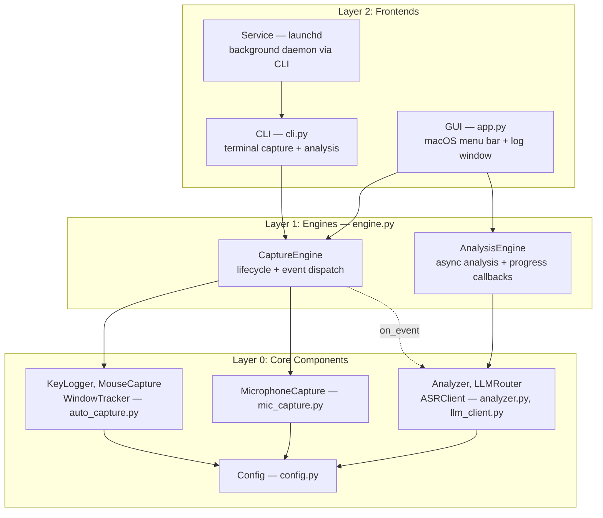
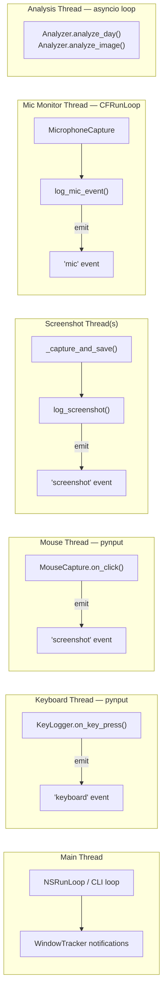
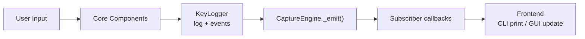

# Three-Layer Architecture Specification

## Overview

OpenCapture uses a three-layer architecture that separates core components, engine logic, and frontends. This enables multiple frontends (CLI, GUI, service) to share the same capture and analysis engines without duplicating logic.

## Layers



## Layer 0: Core Components

Existing classes with minimal changes. These handle raw input capture and AI analysis.

### Capture Components (auto_capture.py, mic_capture.py)

- **KeyLogger** — Keyboard event aggregation, log writing, screenshot/mic event logging
- **MouseCapture** — Click/double-click/drag detection, screenshot capture
- **WindowTracker** — Active window monitoring via NSWorkspace notifications
- **MicrophoneCapture** — Core Audio microphone monitoring, sounddevice recording
- **AutoCapture** — Controller that wires components together, manages pynput listeners

### Analysis Components (analyzer.py, llm_client.py)

- **Analyzer** — Orchestrates image/audio/log analysis and report generation
- **LLMRouter** — Routes requests to configured LLM providers
- **ASRClient** — Audio transcription via Whisper API

### Changes for Engine Support

KeyLogger and AutoCapture accept an optional `on_event` callback. When set, KeyLogger emits events at each write point (keyboard flush, screenshot log, window activation, mic event). This allows the engine layer to observe all activity without modifying core logic.

## Layer 1: Engines (engine.py)

### CaptureEngine

Manages the capture lifecycle and dispatches events to subscribers.

```python
class CaptureEngine:
    def __init__(self, config: Config)
    def subscribe(self, event_type: str, callback: Callable)  # '*' for all
    def start(self)   # Creates AutoCapture, starts listeners
    def stop(self)    # Stops capture, emits status event
    def is_running -> bool
    def get_status(self) -> dict  # Today's stats
    def check_accessibility(prompt=False) -> bool
```

**Event types:** `keyboard`, `screenshot`, `window`, `mic`, `status`

**Key design decisions:**
- Does NOT own NSRunLoop — the frontend is responsible for running the event loop
- Events fire from capture threads; frontends must dispatch to their own main thread
- Subscriber callbacks receive `(event_type: str, data: dict)`

### AnalysisEngine

Runs analysis tasks in a background asyncio event loop.

```python
class AnalysisEngine:
    def __init__(self, config: Config)
    def start(self)   # Start background event loop thread
    def stop(self)    # Stop event loop and thread
    def analyze_today(self, provider=None, callback=None)
    def analyze_image(self, path, provider=None, callback=None)
    def health_check(self, callback=None)
```

**Key design decisions:**
- Owns its own asyncio event loop in a daemon thread
- Callbacks are invoked from the asyncio thread; frontends dispatch to main thread
- Accepts Config object (not raw dicts)

## Layer 2: Frontends

### CLI (cli.py)

The existing command-line interface. Uses AutoCapture directly for capture mode (backwards compatible) and can optionally use CaptureEngine.

- `opencapture` — Foreground capture (AutoCapture.run())
- `opencapture --analyze today` — Analysis via Analyzer
- `opencapture start/stop/status` — launchd service management
- `opencapture gui` — Launch GUI frontend

### GUI (app.py)

macOS menu bar application using PyObjC.

- NSStatusItem in the system menu bar
- Start/Stop capture toggle
- Log window showing real-time events
- Analyze Today trigger with progress feedback
- Uses CaptureEngine + AnalysisEngine
- NSApplication.run() pumps NSRunLoop (required for WindowTracker)

### Service (launchd)

Background daemon managed via `opencapture start/stop`. Runs the CLI in capture mode as a LaunchAgent. No changes needed.

## Thread Model



All log writes are serialized through `KeyLogger._lock`. Engine event callbacks fire from the originating thread — frontends are responsible for dispatching to their main thread if needed.

## Data Flow


