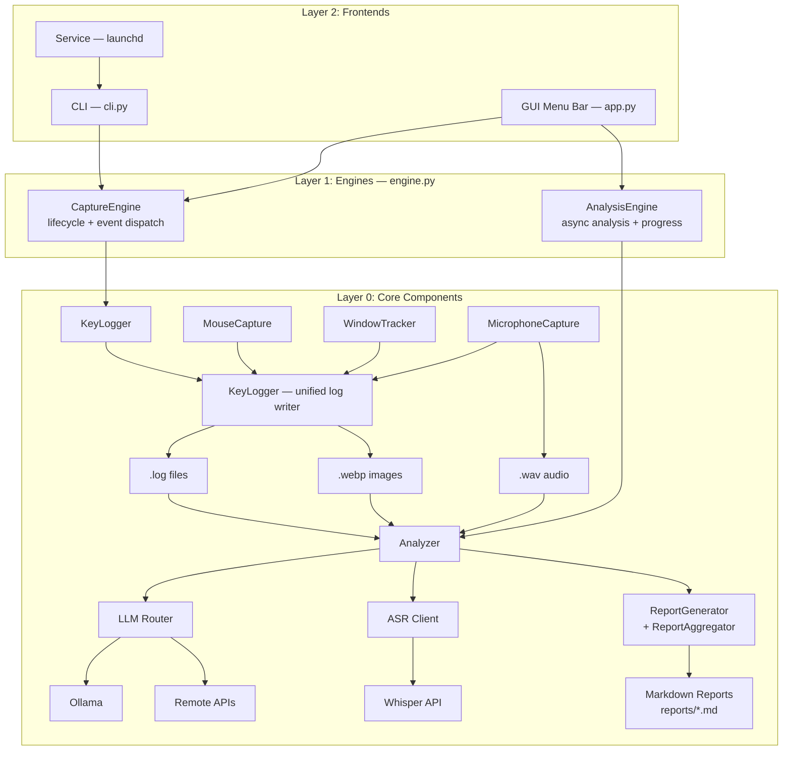

# OpenCapture Technical Design

## Project Overview

OpenCapture is a tool for automatically recording user keyboard and mouse behavior, with local data storage and AI analysis support.

### Core Features

1. **Data Collection** - Keyboard input, mouse actions, screenshots
2. **AI Analysis** - Supports local Ollama and remote APIs (OpenAI, Claude)
3. **Report Generation** - Generates analysis reports in Markdown format
4. **Privacy Security** - All data stored locally

---

## System Architecture

Three-layer design: Core Components → Engines → Frontends. See `docs/specs/architecture.md` for full specification.



---

## Directory Structure

```
~/opencapture/                    # Default data directory
├── 2026-02-05/                    # Organized by date
│   ├── 2026-02-05.log            # Unified log (keyboard + mouse)
│   ├── click_103045_*.webp       # Mouse click screenshots
│   ├── dblclick_*.webp           # Double-click screenshots
│   └── drag_*.webp               # Drag screenshots
│
├── reports/                       # AI analysis report directory
│   ├── 2026-02-05.md             # Daily analysis report
│   ├── 2026-02-05_images.md      # Image analysis details
│   └── weekly_2026-W06.md        # Weekly report (optional)
│
└── config.yaml                    # User configuration file (optional)
```

---

## Configuration System

### Configuration File (config.yaml)

```yaml
# OpenCapture Configuration

# Basic settings
capture:
  output_dir: ~/opencapture        # Data storage directory
  image_format: webp                # Image format
  image_quality: 80                 # Compression quality

# LLM configuration
llm:
  default_provider: ollama          # ollama | openai | anthropic | custom

  ollama:
    enabled: true
    api_url: http://localhost:11434
    model: qwen2-vl:7b

  openai:
    enabled: false
    api_key: ${OPENAI_API_KEY}      # Supports environment variables
    model: gpt-4o

  anthropic:
    enabled: false
    api_key: ${ANTHROPIC_API_KEY}
    model: claude-sonnet-4-20250514

# Analysis prompts
prompts:
  image:
    click: "Analyze this screenshot..."
    dblclick: "..."
    drag: "..."
  keyboard:
    analyze: "Analyze keyboard input..."
```

### Configuration Priority

1. Environment variables (highest priority)
2. User config file (`~/.opencapture/config.yaml`)
3. Default configuration

### Environment Variable Mapping

| Environment Variable | Config Path | Description |
|---------------------|-------------|-------------|
| `OPENCAPTURE_OUTPUT_DIR` | `capture.output_dir` | Storage directory |
| `OPENCAPTURE_LLM_PROVIDER` | `llm.default_provider` | Default LLM |
| `OLLAMA_API_URL` | `llm.ollama.api_url` | Ollama URL |
| `OLLAMA_MODEL` | `llm.ollama.model` | Ollama model |
| `OPENAI_API_KEY` | `llm.openai.api_key` | OpenAI key |
| `ANTHROPIC_API_KEY` | `llm.anthropic.api_key` | Claude key |

---

## LLM Client Design

### Unified Interface

```python
class BaseLLMClient(ABC):
    """Base class for LLM clients"""

    @abstractmethod
    async def analyze_image(
        self,
        image_path: str,
        prompt: str,
        system_prompt: str = None
    ) -> AnalysisResult:
        """Analyze image"""
        pass

    @abstractmethod
    async def analyze_text(
        self,
        text: str,
        prompt: str,
        system_prompt: str = None
    ) -> AnalysisResult:
        """Analyze text"""
        pass

    @abstractmethod
    async def health_check(self) -> bool:
        """Health check"""
        pass
```

### Supported Providers

| Provider | Image Analysis | Text Analysis | Notes |
|----------|---------------|---------------|-------|
| Ollama | ✅ | ✅ | Local deployment, privacy-safe |
| OpenAI | ✅ | ✅ | GPT-4o supports images |
| Anthropic | ✅ | ✅ | Claude supports images |
| Custom | ✅ | ✅ | OpenAI-compatible format |

---

## Implementation Status

> Updated: 2026-02-05

### Completed

| File | Status | Description |
|------|--------|-------------|
| `src/opencapture/llm_client.py` | ✅ Done | LLM unified interface with Ollama/OpenAI/Anthropic |
| `src/opencapture/report_generator.py` | ✅ Done | Markdown report generator |
| `src/opencapture/analyzer.py` | ✅ Done | Unified analyzer integrating all modules |
| `src/opencapture/config.py` | ✅ Done | Extended configuration, multi-provider support |
| `src/opencapture/cli.py` | ✅ Done | Unified CLI: capture, analysis, service management |
| `src/opencapture/config/example.yaml` | ✅ Done | Complete example configuration |
| `run.py` | ✅ Done | Development entry point (thin wrapper) |
| `pyproject.toml` | ✅ Done | Package metadata and dependencies |

### Core Features

- [x] Multi-LLM provider support (Ollama, OpenAI, Anthropic, Custom)
- [x] Environment variable API key configuration
- [x] Configurable prompt templates
- [x] Markdown daily report generation
- [x] Markdown image analysis report
- [x] Per-image txt description files
- [x] Batch analysis (skip already analyzed)
- [x] Unified CLI entry point

### To Be Implemented

- [ ] Idle detection auto-trigger analysis
- [ ] Scheduled task scheduling
- [ ] Weekly/monthly report generation
- [x] GUI — macOS menu bar app (app.py, engine.py)
- [ ] Web UI interface

---

## File List

| File | Description |
|------|-------------|
| `src/opencapture/auto_capture.py` | Core capture: KeyLogger, MouseCapture, WindowTracker, AutoCapture |
| `src/opencapture/mic_capture.py` | Microphone monitoring (macOS Core Audio + sounddevice) |
| `src/opencapture/engine.py` | Engine layer: CaptureEngine + AnalysisEngine |
| `src/opencapture/app.py` | GUI frontend: macOS menu bar app + log window |
| `src/opencapture/llm_client.py` | LLM clients (Ollama/OpenAI/Anthropic) |
| `src/opencapture/report_generator.py` | Markdown report generation |
| `src/opencapture/analyzer.py` | Unified analyzer |
| `src/opencapture/config.py` | Configuration management |
| `src/opencapture/cli.py` | Unified CLI: capture, analysis, service management, GUI launch |
| `src/opencapture/config/example.yaml` | Example configuration |
| `run.py` | Development entry point |
| `pyproject.toml` | Package metadata and dependencies |
| `packaging/macos.spec` | PyInstaller spec for macOS .app bundle |

---

## Security Considerations

1. **API Key Security**
   - Supports environment variables
   - Config files don't contain plaintext keys
   - `.gitignore` excludes config files

2. **Data Privacy**
   - All data stored locally
   - Configurable sensitive window exclusion
   - Password input filtering

3. **Network Security**
   - HTTPS encrypted transmission
   - API keys only in request headers
   - Proxy configuration support

---

## Performance Metrics

| Metric | Target | Notes |
|--------|--------|-------|
| Memory Usage | < 200MB | During capture |
| CPU Usage | < 5% | When idle |
| Screenshot Latency | < 100ms | From click to save |
| Analysis Latency | < 30s | Per image (local) |
| Analysis Latency | < 10s | Per image (remote) |
